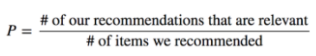

# Laporan Proyek Sistem Rekomenasi - Andreas Kevin

Pada era teknologi digital, tenologi machine learning menjadi teknologi utama dalam pengolahan dan analisis data. Machine learning membantu dalam banyak kasus. Penerapan machine learning saat bermacam, seperti kasus rekomendasi. Kasus rekomenasi merupakan kasus yang dilakukan dalam memberikan rekomenasi atas berbagai pilihan yang harus dipilih oleh costumers. 

Teknik rekomendasi dalam machine learning telah diadopsi dalam berbagai hal seperti sosial media dalam memberikan postingan yang disukai, marketplace dalam memberikan rekomendasi produk yang diinginkan oleh costumers, hingga dalam skala global seperi dilakukan oleh e-commerce seperti amazone, netflix, dan spotify.

Proyek ini memiliki tujuan untuk pengembangan model rekomendasri dalam membantu dalam menentukan rekomendasi lagu. Fokus utama pengembangan model machine learning ini menggunakan pendekatan Content-Based Filtering dan Collaborative Filtering.

Proyek ini dijadikan sebagai hal  penting diselesaikan karena dengan proyek ini, akan membantu pengguna dalam menentukan lagu yang harus dipilih berdasarkan lagu yang mereka dengar sebelumnya dan pada kasus ini dilakukan perbandingan model terbaik dalam solusi atas permasalahan tersebu. Dengan adanya model rekomendasi yang akurat, pengguna akan terbantu dalam membuat keputusan yang lebih cepat dalam menentukan lagu dan ini akan memberikan manfaat kepada aplikasi dlam memberikan rekomenadi lagu kepada pengguna.
  Beberapa hal yang membuat penelitian ini penting dilakukan dan penelitian sebelumnya mengenai teknik rekomendasi yang didasari pada:
  - [Menakar Preferensi Musik di Kalangan Remaja: Antara Musik Populer Dan Musik Klasik](https://e-journal.hamzanwadi.ac.id/index.php/tmmt/article/view/4365/2192), memaparkan akan fokus berbagai macam musik populer di kalangan remaja.
  - [Pengembangan Sistem Rekomendasi Berbasis Kecerdasan Buatan Untuk Meningkatkan Pengalaman Pengguna Di Platform E-Commerce](https://ejurnal.lkpkaryaprima.id/index.php/juktisi/article/download/145/112), penelitian tersebut berisi pentinya penggunaan AI dalam memberikan pengalaman pengguna terutama dalam E-Commerce.
  - [Pemanfaatan Sistem Rekomendasi Menggunakan Content-Based Filtering pada Hotel di Palangka Raya](https://ojs.uniska-bjm.ac.id/index.php/JIT/article/view/16282), menyampaikan pemanfaatan Content-Bsed Filtering yang dianggap akurat dalam rekomendasi hotel di Palangka Raya.
  - [PREFERENSI MUSIK DI KALANGAN REMAJA](https://journal.isi.ac.id/index.php/promusika/article/download/541/753), yang memparkan bahwa terdpat banyak faktor dalam pemempgaruhi ketertarikan seseorang terhadap genre musik.

---
### ⚠️ Problem Statements
Adapun yang menjadi dasar masalah dalam penelitian ini berupa:
- Bagaimana sistem dapat memberikan rekomendasi lagu yang relevan berdasarkan kemiripan konten (judul lagu) dan kemiripan konten tersebut tercermin dalam skor evaluasi?
- Bagaimana sistem memberikan rekomendasi lagu secara personal kepada pengguna berdasarkan favorite artis sebelumnya, dan seberapa akurat model tersebut dalam memprediksi skor/penilaian terhadap lagu yang belum pernah didengarkan?

---
### ✨ Goals
Berdasarkan problem statements yang telah dipaparkan penulis, adapun yang menjadi tujuan dalam penelitian ini yaitu:
- Menentukan model rekomendasi yang dapat digunakn dalam menentukan solusi terbaik atas rekomendasi lagu.
- Membandingkan dan memberikan solusi atas perbandingan tersebut untuk sistem rekomendasi terbaik.

---
### 💡 Solution Approach
Dalam menyelesaikan permasalahan yang telah diidentifikasi tersebut, penelitian ini menerapkan pendekatan berbasis machine learning dengan memanfaatkan . Penelitian dilakukan dengan menggunakan algoritma machine learning yaitu Content Base Filtering dan Collaborative Filtering. Dalam Collaborative Filtering, digunakan teknik neural network dalam membantu model ini. Dalam meningkatkan pembelajaran yang lebih baik, penelitian dilkaukan dengan beberapa proses yang meliputi pengolahan data, eksplorasi fitur, pemilihan model, hingga evaluasi performa untuk memastikan akurasi yang optimal dalam prediksi diabetes.

## 📑 Data Understanding
Dataset merupakan kumpulan data yang teorganisir. Pada kasus ini digunakan dataset lagu. Dataset berisikan kumpulan lagu yang diperoleh dari kaggle. [Song Dataset](https://www.kaggle.com/datasets/deependraverma13/all-songs-rating-review/data).

### Variabel-variabel yang terdapat pada dataset tersebut yaitu:
- **Name of the song** = Berisikan nama lagu-lagu.
- **Artist** = Berisikan nama artis dari lagu tersebut.
- **Date of Release** = Tanggal dirilis lagu tersebut.
- **Description** = Rincian deskripsi mengenai lagu.
- **Metascore** = Nilai rata-rata berdasarkan kritikus.
- **User Score** = Nilai score dari pengguna mengenai lagu tersebut.  


---
### Proses analisis data
Proses pengumpulan data yang telah dilkaukan kemudian dilakukan analisis atas data teresebut. Analisis terebut dilkukan untuk memahami konidisi isi atas data tersebut. Beberapa teknik analisis yang dilakukan berupa: 
- **.info()** untuk meliht informasi atas dataset terserbut berupa jenis tipe data hingga jumlah data.
- **isnull().sum()** digunakan untuk menilai jumlah data yang kosong pada data. 
- **.duplicated().sum()** untuk menilai jumlah duplikasi pada data. Pada bagian ini terlihat jumlah duplikasi pada data adalah 0.
- **.duplicated(subset=['Name of the Song']).sum()** untuk melihat jumlah duplikasi data pada atribut Name of the Song. Pada ini terdapat data lagu yang duplicate.

- Data berisikan 7 atribut.
- Data total terdiri dari 198126 Data.
- Terdapat data kosong pada Description berjumlah 4369 data, Metascore berjumlah 24385 data, dan User Score berjumlah 49281 data.
- Jumlah duplikasi berdapatkan judul lagu terdapat 194214 lagu.

---
### Visualisasi Data
Beberapa teknik visualisasi digunakan untuk memahami distribusi data antara lain:
- **Histogram**: Digunakan untuk melihat distribusi frekuensi data dalam tiap variabel.


## 🛠️ Data Preparation
Data preparation merupakan proses penyiapan data agar dapat diproses lebih lanjut (sebelum dilakukan pelatihan atas model). Pada kasus ini, proses data preparation dapat diuraikan menjadi:

---
### Data Preparation General for Content Base Filtering and Collaborative Filtering  
- **.dropna()** untuk membuang baris yang kosong.
- **.drop_duplicates(subset=["Name of the Song"])** untuk membuang data yang kosong tersebut.
```python
df_songs_encode['Artist'] = df_songs['Artist'].str.replace(r'^by\s+', '', regex=True)
```
- Pada dataframe tersebut terlihat data pada atribut Artist dengan setiap nama artis dimulai dengan awal "by". Maka akan dilakukan proses untuk membuang kata by di setiap awal nama artis tersebut.  

**Total data setelah dibersihkan terdiri dari 2537 data dengan 7 atribut.**  
  
---
### 1. Data Preparation Content Base Filtering
Data preparation untuk Content Base Filtering didasari pada :
- Membuang atribut **Description, Unnamed: 0, dan Date of Release**. Tujuan dari pembuangan atribut ini untuk mempersiapkan atribut yang akan digunakan pada proses CBF.
- TF-IDF digunakan untuk mengubah judul lagu menjadi representasi numerik.
```python
tf = TfidfVectorizer()
tfidf_matrix = tf.fit_transform(df_songs['Name of the Song']) 

tfidf_matrix.shape 
tfidf_matrix.todense()
```

---
### 2. Data Preparation Collaborative Filtering
Data preparation untuk Collaborative Filering didasari pada:
- Penggunaan encoder untuk mengubah data sring menjadi numerik yang terdiri dari atribut **Artist** dan **Name of the Song**.
- Melakukan normalisasi pada data sebagai berikut:
```python
min_rating = min(df_songs['Metascore'])
max_rating = max(df_songs['Metascore'])

x = df_songs[['Artist', 'Name of the Song']].values
y = df_songs['Metascore'].apply(lambda x: (x - min_rating) / (max_rating - min_rating)).values

scaler_x = MinMaxScaler()
x = scaler_x.fit_transform(x)
```
Proses tersebut membagi dataset menjadi x sebagai input dan y sebagai output.
- Proses pembgian dataset menjadi train dan test yang dibagi menjadi 80% sebagai train dan 20% sebagai test.
```python
train_indices = int(0.8 * df_songs.shape[0])
x_train, x_val, y_train, y_val = (
    x[:train_indices],
    x[train_indices:],
    y[:train_indices],
    y[train_indices:]
)
```

## 🤖 Modeling and Result
Proses modeling memuat proses perancangan model yang digunakan dalam rekomendasi.

---
### Content Base Filtering
Content Base Filtering yang dibagun didasarkan pada beberapa komponen penting yang berupa:
- Cosine similarity dihitung similariity antar judul lagu, menghasilkan matriks similarity.
```python
tf = TfidfVectorizer()
tfidf_matrix = tf.fit_transform(df_songs['Name of the Song']) 
```
- Menghitung cousin similarity pada setiap atribut
```python
cosine_sim = cosine_similarity(tfidf_matrix) 
```
Proses ini adalah proses inti dalam content base filtering. Content base filtering penting dalam menghitung similarity hal ini dikarenakan content base filtering mengukur kemiripan antara lagu-lagu.
- Fungsi Rekomenadasi pada 
```python
  closest = similarity_data.columns[index[-1:-(k+2):-1]]
```
yang pada proses ini mengambil index dari nilai similarity tertinggi dan mengeluarkan rekomendasi lagu yang paling relevan.

---
### Solusi - Top 5 rekomendasi pada teknik Content Base Filtering
Solusi yang dibangun dirancang menggunakan:
```python
def song_recomendations(target_song_artist, similarity_data=cosine_sim_df, items=df_songs[['Name of the Song', 'Artist']], k=5):
    index = similarity_data.loc[:,target_song_artist].to_numpy().argpartition(
        range(-1, -k, -1)).flatten()
    
    closest = similarity_data.columns[index[-1:-(k+2):-1]]
    
    closest = closest.drop(target_song_artist, errors='ignore')
 
    return pd.DataFrame(closest).merge(items).head(k)

    song_recomendations('The Midnight Organ Fight')
```
- **def song_recommendations(...)** digunakan sebagai fungsi rekomendasi lagu berdasarkan kemiripan (similarity) antar lagu dan artis.
- **similarity_data.loc[:, target_song_artist].to_numpy().argpartition(...)** digunakan untuk mencari index dari lagu yang paling mirip (nilai similarity tertinggi) terhadap lagu/artis target, tanpa mengurutkan seluruh data (lebih efisien).
- **closest = similarity_data.columns[index[-1:-(k+2):-1]]** mengambil k+1 lagu teratas dari hasil similarity tertinggi (termasuk lagu target).
- **closest.drop(target_song_artist, errors='ignore')** memastikan lagu/artis yang sama tidak direkomendasikan.
- **pd.DataFrame(closest).merge(items)** menggabungkan hasil rekomendasi dengan informasi lagu dan artis dari data asli.

---
### Top n Rekomendasi Content Base Filtering
Pada hasil content base filtering akan menghasilkan output dengan memunculkn 5 lagu yang paling mendekati berdasarkan kata yang terdapat pada lagu yang dicari. Adapun contoh dari hasil tersebut adalah sebagai berikut:  
  
  
  


---
### Collaborative Filtering
Beberapa hal yang mendasari pada collaborative filtering adalah sebagai berikut:
- Collaborative filtering dibangun dengan model neural network dengan bantuan TensorFlow dan keras. Proses ini dilakukan dengan membuat vektor berdimensi embendding untuk artist dan lagu untuk menangkap hubungan antar indentitas.
- Dot product (hasil dari 2 vektor yang menghasilkan angka skalar (digunakan dalam sistem rekomendasi berbasis embedding)) antara embending artis dan lagu diikuti dengan penambahan bias dalam menghasilkan prediksi rating yang dinormalisasi melalui fungsi sigmoid.
```python
# Dot product antara artist dan song
dot_artist_song = tf.reduce_sum(artist_vector * song_vector, axis=1, keepdims=True)

# Menambahkan bias
x = dot_artist_song + artist_bias + song_bias
x = self.dropout(x)

# Aktivasi sigmoid untuk output antara 0 dan 1
return tf.nn.sigmoid(x)
```
- Model dilakukan komplikasi menggunakan MSE sebagai loss function dan RMSE sebagai metrik evaluasi.
```python
model.compile(
    loss=tf.keras.losses.MeanSquaredError(),  # karena output sigmoid (0-1)
    optimizer=keras.optimizers.Adam(learning_rate=0.001),
    metrics=[tf.keras.metrics.RootMeanSquaredError()]
)
```
- Proses callback dilakukan agar proses latih dihentikan ketika mencapai nilai yang diinginkan.
- Proses kemudian dilakukan latih dengan fungsi **.fit(...)**
```python
history = model.fit(
    x = x_train,
    y = y_train,
    batch_size = 64,
    epochs = 100,
    callbacks=[callbacks, early_stop, reduce_lr], 
    validation_data = (x_val, y_val),
    verbose=1 
)
```
proses tersebut meliputi pelatihan, hingga selesainya yang dimaksimalkan dengan x dari x_train dan y dari y_train, dengan ukuran data setiap pelatihan yaitu 64, 100 iterasi maksimal, batas callbacks, dan validasi data berdasarkan x_val dan y_val yang telah dibangun, serta menampilkan proses bar selama pelatihan dengan verbose=1.

---
### Solusi - Top 5 rekomendasi pada teknik Collaborative Filtering
```python
import pandas as pd

artist_id = df_songs.Artist.sample(1).iloc[0]

songs_by_artist = df_songs[df_songs.Artist == artist_id]

songs_not_by_artist = df_songs[~df_songs['Name of the Song'].isin(songs_by_artist['Name of the Song'].values)]
songs_not_by_artist_ids = songs_not_by_artist['Name of the Song'].values

artist_song_array = np.hstack(
    ([[artist_id]] * len(songs_not_by_artist_ids), songs_not_by_artist_ids.reshape(-1, 1))
)

ratings = model.predict(artist_song_array).flatten()
top_ratings_indices = ratings.argsort()[-5:][::-1]
recommended_song_ids = songs_not_by_artist_ids[top_ratings_indices]

artist_name = le_artist.inverse_transform([artist_id - 1])[0]  
recommended_song_titles = le_song.inverse_transform(recommended_song_ids.astype(int))
recommended_scores = ratings[top_ratings_indices]
```
- **artist_id = df_songs.Artist.sample(1).iloc[0]** digunakan untuk mengambil artis secara acak dari dataset.
- **songs_by_artist = df_songs[df_songs.Artist == artist_id]** berisi semua lagu yang sudah pernah dibuat oleh artis tersebut.
- **songs_not_by_artist = df_songs[~df_songs['Name of the Song'].isin(songs_by_artist['Name of the Song'].values)]** berisi lagu-lagu yang belum dibuat oleh artis itu, dan akan menjadi kandidat untuk rekomendasi.
- **artist_song_array** array berisi pasangan [artist_id, song_id] yang dibentuk untuk setiap lagu yang belum dibuat oleh artis, sebagai input ke model.
- **model.predict(...)** untuk memprediksi seberapa besar kemungkinan artis membuat lagu-lagu tersebut.
- **ratings.argsort()[-5:][::-1]** mengambil 5 lagu teratas dengan skor prediksi tertinggi sebagai hasil rekomendasi.
- **le_artist.inverse_transform(...)** dan **le_song.inverse_transform(...)** digunakan untuk mengubah kembali ID artis dan lagu ke bentuk nama aslinya, karena sebelumnya sudah melalui proses encoding.

---
### Top n Rekomendasi Collaborative Filtering
Pada hasil collaborative filtering akan menghasilkan output dengan memunculkn 5 lagu yang paling mendekati berdasarkan interaksi user (artis dan lagu). Adapun contoh dari hasil tersebut adalah sebagai berikut:  
  

---
### Kelebihan dan kekurangan CBF dan CF
#### Content Base Filtering
**Kelebihan:**
- Tidak memerlukan data interaksi pengguna (user rating), cukup dari konten seperti judul lagu.
- Dapat memberikan rekomendasi meskipun hanya berdasarkan satu lagu (cocok untuk cold start user).
- Proses implementasi relatif lebih sederhana dan cepat.

**Kekurangan:**
- Merekomedasikan lagu yang mirip dengan yang sudah diketahui, sehingga tidak bisa menangkap selera musik yang lebih luas.
- Berdasarkan model yang dibangun, CBS bergantung sepenuhnya pada judul lagu.


#### Colaborative Filtering
**Kelebihan:**
- Mampu menangkap pola selera pengguna berdasarkan interaksi (artis dan lagu dengan rating).
- Memberikan rekomendasi yang lebih personal karena mempertmbangkan relasi antara artis dan lagu.
- Bisa memberikan rekomendasi yang tidak memiliki kemiripan konten.

**Kekurangan:**
- Butuh data interaksi dalam jumlah cukup besar untuk bekerja optimal.
- Rumit dalam hal pemodelan dan pelatihan (butuh arsitektur neural network, dll.).


## 🔍 Evaluation
### Evaluasi Content Based Filtering
Evaluasi dilakukan dengan menghitung precission. Ini dilakukan dengan perintah
```python
def tokenisasi(teks):
    return set(re.findall(r'\b\w+\b', teks.lower()))

def presisi_untuk_lagu_acak(data_lagu, matriks_similarity, k=3):
    lagu_target = data_lagu['Name of the Song'].sample(n=1).values[0]
    print(f"Lagu target yang dipilih secara acak: {lagu_target}")

    if lagu_target not in matriks_similarity.columns:
        print(f"Lagu {lagu_target} tidak ditemukan dalam matriks kemiripan.")
        return

    try:
        rekomendasi = song_recomendations(lagu_target, similarity_data=matriks_similarity, k=k)
    except Exception as e:
        print(f"Terjadi kesalahan: {e}")
        return

    token_target = tokenisasi(lagu_target)
    if not token_target:
        print(f"Tidak ada token untuk lagu target: {lagu_target}")
        return

    jumlah_relevan = 0
    for judul_lagu_rekom in rekomendasi['Name of the Song']:
        token_rekom = tokenisasi(judul_lagu_rekom)
        if token_target & token_rekom:
            jumlah_relevan += 1

    presisi = jumlah_relevan / k
    print(f"Presisi untuk lagu target {lagu_target}: {presisi:.2f}")

    # Simpan contoh hasil rekomendasi ke dalam DataFrame
    hasil_df = rekomendasi.copy()
    hasil_df.insert(0, "Judul Lagu Target", lagu_target)

    print("\n Hasil rekomendasi dan presisi:")
    display(hasil_df)

    return presisi, hasil_df
```
proses tersebut meliputi:  
- **lagu_target = data_lagu['Name of the Song'].sample(n=1).values[0]** = Memilih satu lagu secara acak dari dataset data_lagu sebagai lagu target untuk rekomendasi.
- **if lagu_target not in matriks_similarity.columns:** = Mengecek apakah lagu target tersedia dalam matriks similarity. Jika tidak ada, fungsi dihentikan.
- **song_recommendations(lagu_target, similarity_data=matriks_similarity, k=k)** = Memanggil fungsi untuk mendapatkan k rekomendasi lagu teratas berdasarkan lagu target dan matriks similarity.
- **token_target = tokenisasi(lagu_target)** = Melakukan tokenisasi (pemecahan kata) terhadap judul lagu target agar bisa dibandingkan dengan lagu-lagu hasil rekomendasi.
- **if token_target & token_rekom:** = Mengecek apakah terdapat irisan (kesamaan token/kata) antara lagu target dan lagu yang direkomendasikan. Jika ya, dianggap relevan.
- **presisi = jumlah_relevan / k** = Menghitung nilai precision, yaitu rasio antara jumlah lagu relevan yang direkomendasikan dibanding total jumlah rekomendasi (k).

- **hasil_df = rekomendasi.copy()** = Menyimpan hasil rekomendasi dalam bentuk DataFrame untuk ditampilkan atau dianalisis lebih lanjut.

Fungsi ini memberikan gambaran seberapa relevan hasil rekomendasi lagu berdasarkan kemiripan token judul.

---
### Evaluasi Collaborative Filtering
Evaluasi atas collaborative Filltering meliputi penggunaan RMSE berdasarkan perbandingan dari y_value dan y_prediksi.


```python
rmse = np.sqrt(mean_squared_error(y_val, y_pred))
```
- RMSE cocok digunakan dalam kasus collaborative filtering dikarenakan mengukur jarak asli dengan hasil prediksi sehingga metode evaluasi ini dinilai cocok. 
- Hasil evaluasi diperoleh nilai RMSE 0,1952 yang merupakan baik dikarenakan RMSE < 0,2. Hal ini dengan mempertimbangkan dataset yang besar dan bervariasi sehingga Collaborative Filtering dianggap mampu untuk menebak score lagu.

## 🎯 Kesimpulan
- Content-Base Filtering lebih mudah dalam penerapan karena hanya menggunakan TF-IDF dan cosine similarity berdasarkan kemiripan judul lagu dengan hasil precission adalah 0,80 atau 80%.
- Collavorative filtering lebih sulit dalam hal implementasi karena membutuhkan model neural network, dll dalam membantu model ini. Tetapi hasil testing pada collaborative filtering mampu mencapai nilai RMSE 0,1946 yang dianggap baik karena nilai RMSE < 0,2.
- Content Base filtering tidak bisa menangkap selera pengguna secara kolektif sedangkan collaborative filtering Cocok untuk sistem dengan banyak user dan interaksi.
- Berdasarkan hasil Content-Base Filtering dan Collaborative Filtering, Content Base Filtering dapat dipercaya dalam memberikan saran rekomendasi lagu dikarenakan precision mencapai 80%. Pada kasus ini, Collaborative Filtering dapat dipercaya dalam memberikan rekomendasi lagu berdasarkan penyanyi.